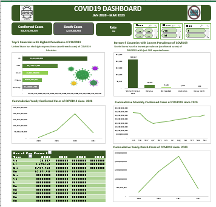

# COVID19 Analysis
---

---
# Introduction: 

The first instance of a novel coronavirus was discovered in December 2019, and since then, the number of coronavirus cases has been rising daily. As everyone is aware, the first wave of COVID-19 claimed a large number of lives, and the second wave of COVID-19 saw an increase in deaths.

Although COVID-19 is typically moderate and self-limiting, a significant percentage of patients experience severe and deadly symptoms. Appropriate clinical decision-making requires knowing which patients are more likely to experience a serious illness or pass away.

# Problem Statements:

1.	Top 5 countries where COVID-19 is most prevalent
2.	The bottom five countries where COVID-19 is least common
3.	Since 2020, what has been the total number of COVID-19 confirmed cases on an annual and monthly basis?
4.	In 2022, what was the percentage of confirmed cases?
5.	Since 2020, what has been the total number of COVID-19 mortality cases per year?

# Data Sourcing: 

I scrapped the COVID-19 dataset from GitHub using Excel.

# Data Cleaning and Transformation: 

In order to begin the cleaning procedure, after using Excel to scrape the COVID-19 datasets (confirmed, death, and recovery cases) from GitHub. I then put the data into Excel Power Query by using the transform and load tool. In order to properly name the columns, I started by using the first rows as headers. I then chose the top four (4) columns (province, country, lat, and long) and unpivoted the other columns. This assisted in converting the dataset's wide columns to long columns. I then repeated the procedure for both the death and recovery cases datasets, changing the column with the name “Attribute” to date and “values” to confirmed cases. Finally, I appended the queries (merged the datasets together) and then, closed and loaded it into Excel.
I made the following three (3) new columns in Excel: Year, Month, and Day. Before proceeding with the analysis and visualisation phases, I extracted this information using Excel's YEAR, TEXT, and DAY functions.

# Data Analysis and Visualization:

1. Between January 2020 and March 2023, there were 316bn plus cumulative confirmed cases and 4bn plus cumulative death cases of COVID-19. 
2. The United States had the greatest prevalence of confirmed COVID-19 cases among the top 5 countries with the highest COVID-19 prevalence over the course of three years (Jan 2020–Mar 2023): India, Brazil, France, Germany, and the United States.
3. North Korea (300) had the lowest prevalence of confirmed COVID-19 cases, while Winter Olympics (214,462) topped the list of the bottom 5 countries with the lowest COVID-19 prevalence over the course of three years (Jan 2020 - Mar 2023): Holy See, Antarctica, MS Zaandam, North Korea, and North Korea.
4. In 2022, there were 196 billion plus confirmed cases, that is about 1% of all verified cases.
5. According to the analysis, the number of COVID-19 confirmed cases increased gradually between 2020 and 2021, increased significantly by around 200 billion cases in 2022, and then sharply decreased by March 2023 (totalling 50 billion instances). According to an analysis of the cumulative monthly confirmed cases of COVID-19 from January 2020 to March 2023, the rate of confirmed cases was greater in January and February (33 billion), declined sharply between March and April (19 billion), and then gradually increased from May to December (31 billion).
6.According to the analysis’s findings, the cumulative annual death cases increased gradually between 2020 and 2021, but in 2022, when the overall number of fatalities reported exceeded two billion. there was a notable spike, and in 2023 the first quarter saw a decline in death cases. It is safe to conclude that 2022 saw a significant number of recorded deaths.
 
 # Summary:
 
Between January 2020 and March 2023, the global impact of COVID-19 was substantial, with over 316 billion confirmed cases and 4 billion deaths. Notably, the United States led in COVID-19 prevalence among the top 5 countries, while North Korea had the lowest incidence. The Winter Olympics reported the least prevalence among the bottom 5 countries. In 2022 alone, 196 billion cases accounted for approximately 1% of total verified cases. The analysis reveals a gradual increase in confirmed cases from 2020 to 2021, a significant surge of around 200 billion cases in 2022, followed by a sharp decline by March 2023. Monthly trends indicated higher rates in January and February, a sharp decline in March and April, and a gradual increase from May to December. Annual death cases rose gradually from 2020 to 2021, spiking in 2022 with over 2 billion fatalities. However, the first quarter of 2023 showed a decline. Overall, 2022 witnessed a notable increase in recorded deaths, emphasizing the need for enhanced global preparedness and targeted interventions.

# Conclusion and Recommendations:

1. Targeted intervention methods must be implemented in high-prevalence locations because to the United States' position among the top 5 countries in terms of COVID-19 prevalence. Effective resource allocation for healthcare, stringent observance of preventive measures, and customised public health initiatives can all help lessen the effects.
2. Given North Korea's low incidence and the Winter Olympics' ability to keep cases to a minimum, international cooperation ought to concentrate on exchanging best practices and offering assistance to countries with lower prevalence. This can involve helping with immunisation campaigns, building out the infrastructure for healthcare, and exchanging expertise.
3. Acknowledging the trend of verified cases showing a notable peak in 2022 and a precipitous decline by March 2023, nations globally ought to intensify their surveillance and readiness for possible resurgences. Future wave effects can be lessened by implementing early warning systems, keeping up a sufficient level of healthcare capacity, and having adaptable reaction plans.
4. Given the significant increase in fatalities that occurred in 2022, it is critical to make a focused effort to lower the death rate. Reducing the effect of the virus on death rates can be accomplished in part by fortifying healthcare systems, guaranteeing the availability of vital medical supplies, and giving priority to vaccinating and treating vulnerable people.
5. The three-year period's confirmed cases and deaths show variations, according to the analysis. Putting data-driven public health campaigns into action can improve resource allocation and communication while guaranteeing that treatments are prompt, effective, and in line with the data's changing patterns.

The events of 2020–2023 highlight how crucial it is for everyone to be ready for pandemics in the future. Countries should make investments in infrastructure, international cooperation, and research to improve the world's capacity to react quickly and efficiently to new infectious dangers.

---
